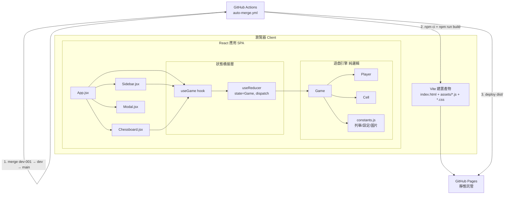
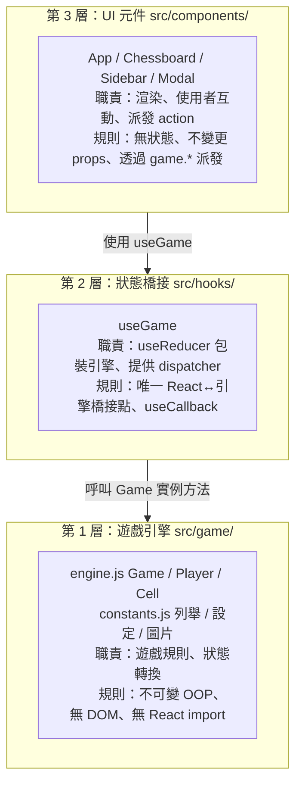
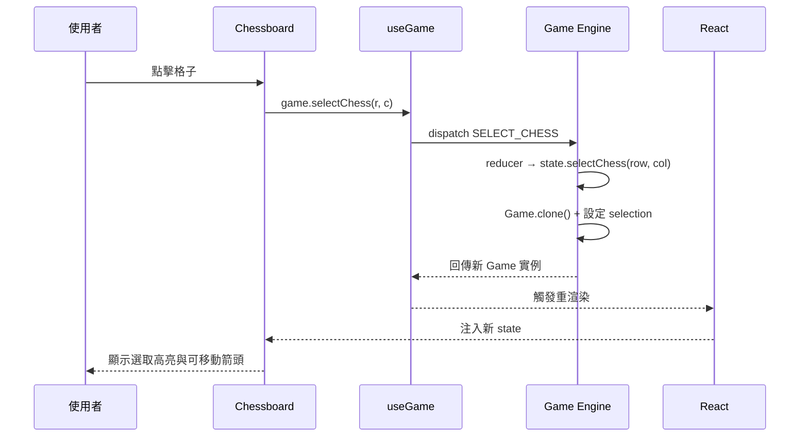
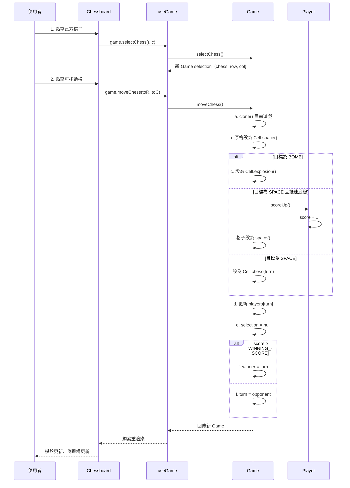
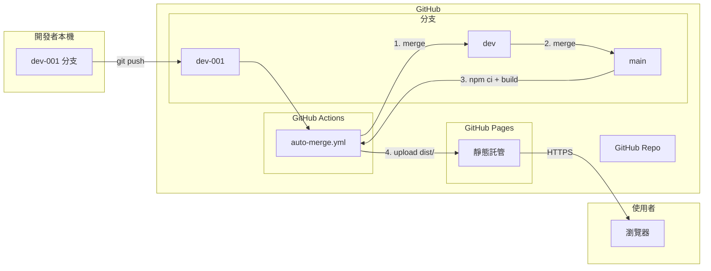
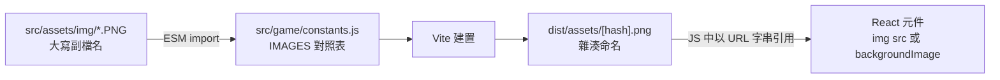

# 系統架構（Architecture）

## 1. 架構總覽



## 2. 分層架構

本系統採嚴格的分層架構，依賴方向**單向向下**：



### 分層規則

| 規則 | 說明 |
|------|------|
| 依賴方向 | 第 3 層 → 第 2 層 → 第 1 層，不可反向 |
| 引擎隔離 | `src/game/` 不可 import React、不可存取 DOM |
| 單一橋接 | `useGame` 是唯一連接 React 與引擎的程式碼 |
| 元件無狀態 | 元件不持有遊戲狀態，僅接收 `game` 並派發 |
| UI 狀態隔離 | 彈窗顯示等 UI 旗標以元件內 `useState` 管理，不放入 reducer |

## 3. 資料流

### 3.1 使用者操作資料流



### 3.2 動作完整生命週期（以移動棋子為例）



## 4. 部署架構



### 分支策略

| 分支 | 用途 | 保護狀態 | 推送者 |
|------|------|----------|--------|
| `dev-001` | 開發分支，唯一手動推送目標 | 無限制 | 開發者 |
| `dev` | 中繼分支 | **未受保護** | 僅管線（`GITHUB_TOKEN`） |
| `main` | 發布分支，部署來源 | **未受保護** | 僅管線（`GITHUB_TOKEN`） |

> `dev` 與 `main` 必須保持未受保護，`GITHUB_TOKEN` 才能推送。若新增保護規則，合併步驟會以 403 失敗。

## 5. 建置架構

### Vite 設定

| 設定 | 值 | 理由 |
|------|-----|------|
| `base` | `'./'` | 輸出相對資源 URL，支援 GitHub Pages 子路徑 |
| `assetsInclude` | `['**/*.PNG']` | 原始圖檔為大寫副檔名，Vite 預設不視為資源 |
| `plugins` | `[@vitejs/plugin-react()]` | JSX 編譯與 Fast Refresh |

### 建置產物

```
dist/
├── index.html              # HTML 入口（引用 hashed JS/CSS）
└── assets/
    ├── index-[hash].js     # 打包後 JS（含 React + 引擎 + 元件）
    └── index-[hash].css    # 打包後 CSS
```

### 圖片處理流程



## 6. 技術棧

| 層 | 技術 | 版本 |
|----|------|------|
| UI 框架 | React | 18.3 |
| 建置工具 | Vite | 5.4 |
| 語言 | JavaScript（JSX） | ES2020+ |
| 模組系統 | ESM | — |
| CI/CD | GitHub Actions | — |
| 部署 | GitHub Pages | — |
| 版本控制 | Git | — |

### 無外部依賴（遊戲邏輯）

遊戲引擎（`src/game/`）不依賴任何 npm 套件，僅依賴 React 開發工具鏈。引擎可獨立於 React 使用。

## 7. 關鍵架構屬性

| 屬性 | 實現方式 |
|------|----------|
| **不可變性** | 引擎每個動作方法回傳新實例，`clone()` 深度複製 |
| **關注點分離** | 引擎／橋接／UI 三層嚴格隔離 |
| **單向資料流** | useReducer dispatch → engine method → new Game → re-render |
| **無副作用引擎** | 引擎無 DOM、無 React、無 I/O |
| **純靜態部署** | 無後端、無資料庫、無 API 呼叫 |
| **自動化管線** | 推送即觸發合併→建置→部署，無手動步驟 |
