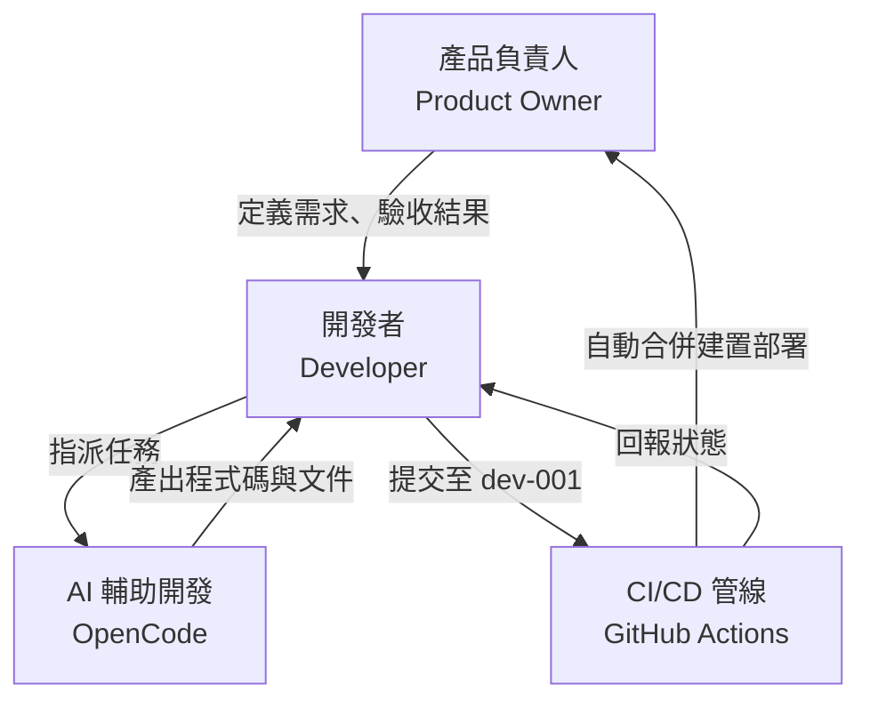
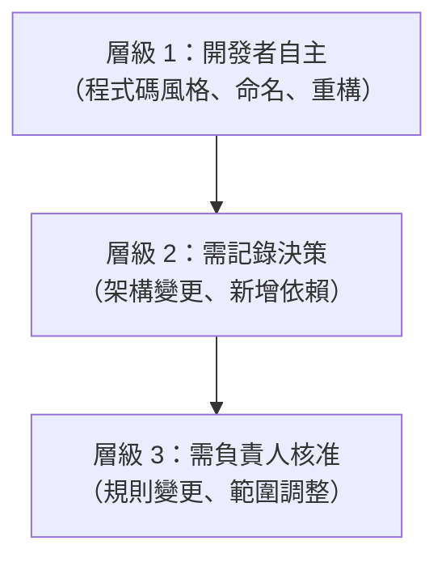
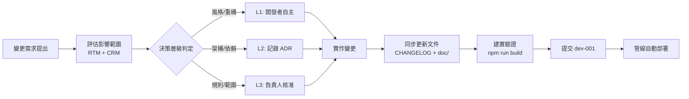

# 專案治理（Project Governance）

本文件定義棋塊陷阱專案的目標、治理結構、角色職責（RACI）、決策權限與變更管理流程。

---

## 1. 專案目標（Goals）

### 1.1 願景

打造一款簡潔、易學但深具策略性的雙人棋盤對戰遊戲，透過方塊與隱形炸彈機制，在傳統棋類移動基礎上增加空間控制與心理博弈層次。

### 1.2 SMART 目標

| 目標 | 具體內容 | 衡量指標 | 達成期限 |
|------|----------|----------|----------|
| **功能完整** | 11 條功能性需求全部實作 | RTM 覆蓋率 100% | v1.0.0 已達成 |
| **品質保障** | 建置零錯誤、管線全綠 | `npm run build` 成功 + Actions success | 持續 |
| **自動化部署** | 推送即部署，無手動步驟 | dev-001 推送至 Pages 上線 < 3 分鐘 | v1.0.2 已達成 |
| **文件齊全** | 完整文件體系（doc/ + TOCTREE） | 11 份文件全部撰寫完成 | v1.3.x 已達成 |
| **繁中優先** | 全部介面與文件為繁體中文 | 無英文殘留（程式碼識別字除外） | v1.2.3 已達成 |

### 1.3 成功標準

- 遊戲規則正確無誤，所有使用者故事驗收條件通過。
- 建置產物 gzip 後 JS < 60 KB。
- GitHub Pages 部署穩定，管線成功率 > 95%。
- 文件與程式碼同步，無過時文件。

---

## 2. 治理結構（Governance Structure）

### 治理原則

| 原則 | 說明 |
|------|------|
| **單一負責人** | 產品負責人為最終決策者 |
| **AI 輔助** | 開發由 OpenCode AI 執行，人工審查合併 |
| **自動化優先** | 部署、合併、建置全部自動化，人工僅推送 dev-001 |
| **文件同步** | 每次變更必須同步更新 CHANGELOG 與 doc/ |
| **追溯性** | 每段程式碼可透過 RTM/CRM 追溯至需求 |

---

## 3. 角色與職責

### 3.1 角色定義

| 角色 | 身份 | 職責範圍 |
|------|------|----------|
| **產品負責人** | Mcc-Mak | 定義產品願景、需求優先級、驗收成果、管理 GitHub 倉庫 |
| **開發者** | OpenCode AI + 人工審查 | 撰寫程式碼與文件、執行建置驗證、提交至 dev-001 |
| **管線** | GitHub Actions bot | 自動合併 dev-001 -> dev -> main、建置、部署至 Pages |

### 3.2 職責詳述

#### 產品負責人

- 維護專案章程與產品需求
- 決定功能優先級與版本規劃
- 驗收部署成果（線上網站）
- 管理 GitHub 倉庫設定（分支、環境、密鑰）
- 審查 AI 產出的程式碼與文件

#### 開發者（AI 輔助）

- 遵循 AGENTS.md 規範進行開發
- 遵守架構不變量（不可變 OOP、單一橋接、繁中 TEXT 常數）
- 每次變更同步更新 CHANGELOG 與 doc/
- 確保 `npm run build` 通過後才提交
- 僅推送至 dev-001，不直接推送 dev 或 main

#### CI/CD 管線

- 推送 dev-001 時自動觸發
- 合併 dev-001 -> dev -> main
- 執行 `npm ci` + `npm run build`
- 部署 dist/ 至 GitHub Pages
- 回報執行狀態

---

## 4. RACI 矩陣

> **R** = Responsible（執行）　**A** = Accountable（當責）　**C** = Consulted（諮詢）　**I** = Informed（知會）

### 4.1 開發流程

| 活動 | 產品負責人 | 開發者 | CI/CD 管線 |
|------|-----------|--------|-----------|
| 需求定義 | **A/R** | C | I |
| 架構決策 | A | **R** | I |
| 程式碼撰寫 | I | **A/R** | — |
| 文件撰寫 | I | **A/R** | — |
| 程式碼審查 | **A** | R | — |
| 建置驗證 | I | R | **A/R** |
| 提交至 dev-001 | I | **A/R** | — |
| 合併 dev-001 -> dev -> main | I | — | **A/R** |
| 部署至 GitHub Pages | I | — | **A/R** |
| 部署結果驗收 | **A/R** | I | I |

### 4.2 維運流程

| 活動 | 產品負責人 | 開發者 | CI/CD 管線 |
|------|-----------|--------|-----------|
| 管線失敗排查 | A | **R** | I |
| 分支保護規則管理 | **A/R** | — | — |
| GitHub Pages 環境設定 | **A/R** | — | — |
| 版本號管理 | C | **A/R** | — |
| CHANGELOG 維護 | I | **A/R** | — |
| doc/ 文件維護 | C | **A/R** | — |

### 4.3 品質流程

| 活動 | 產品負責人 | 開發者 | CI/CD 管線 |
|------|-----------|--------|-----------|
| 需求覆蓋率審查 | A | **R** | — |
| RTM/CRM 更新 | C | **A/R** | — |
| 建置產物大小監控 | I | **A/R** | C |
| 線上網站手動測試 | **A/R** | C | — |
| 文件與程式碼一致性 | A | **R** | — |

---

## 5. 決策權限

### 5.1 決策層級

| 層級 | 決策類型 | 決策者 | 記錄方式 |
|------|----------|--------|----------|
| **L1** | 程式碼風格、命名、內部重構 | 開發者自主 | 無需額外記錄（CHANGELOG 即可） |
| **L2** | 架構決策、新增/移除依賴、技術選型 | 開發者決定並記錄 | 新增 ADR + 更新 Architecture.md |
| **L3** | 遊戲規則變更、產品範圍調整、新增功能 | 產品負責人核准 | 更新 PRD + SRS + ProjectCharter |

### 5.2 決策規則

- **不確定時升至上一層**：若開發者不確定決策層級，預設升至 L2。
- **ADR 不可刪除**：一旦記錄的決策被推翻，新增 ADR 標記舊決策為「已推翻」，不刪除原文。
- **規則變更須雙向更新**：遊戲規則變更須同時更新 PRD、SRS、UserStories、Schema、CHANGELOG。

---

## 6. 變更管理流程

### 6.1 變更流程

### 6.2 變更檢核清單

每次變更提交前，開發者須確認以下項目：

- [ ] `npm run build` 通過
- [ ] `CHANGELOG.md` 已更新（語意化版本）
- [ ] `doc/` 受影響文件已更新
- [ ] `TOCTREE.md` 已更新（若有新文件）
- [ ] RTM/CRM 已更新（若需求或實作變更）
- [ ] ADR 已新增（若為架構決策）
- [ ] PRD/SRS 已更新（若需求變更）
- [ ] 提交訊息符合 Conventional Commits 格式
- [ ] 僅推送至 `dev-001`

---

## 7. 版本治理

### 7.1 語意化版本規則

| 版本段 | 觸發條件 | 範例 |
|--------|----------|------|
| **MAJOR** | 遊戲規則重大變更、向下相容性破壞 | 2.0.0（若有重大規則改版） |
| **MINOR** | 新增功能、文件新增、非破壞性變更 | 1.3.0（新增文件體系） |
| **PATCH** | 錯誤修正、UI 微調、文件修正 | 1.2.1（回合面板色彩） |

### 7.2 發布節奏

- 無固定發布週期，變更完成即提交。
- 每次提交至 dev-001 即觸發自動部署。
- `main` 分支即為生產環境。

### 7.3 回滾策略

若部署至 Pages 後發現問題：

1. 在 dev-001 修正問題並提交（正常流程）。
2. 若需緊急回滾，以 `git revert` 在 dev-001 建立回滾提交並推送。
3. 管線自動合併至 dev -> main 並重新部署。
4. **不直接操作 main 分支**。
