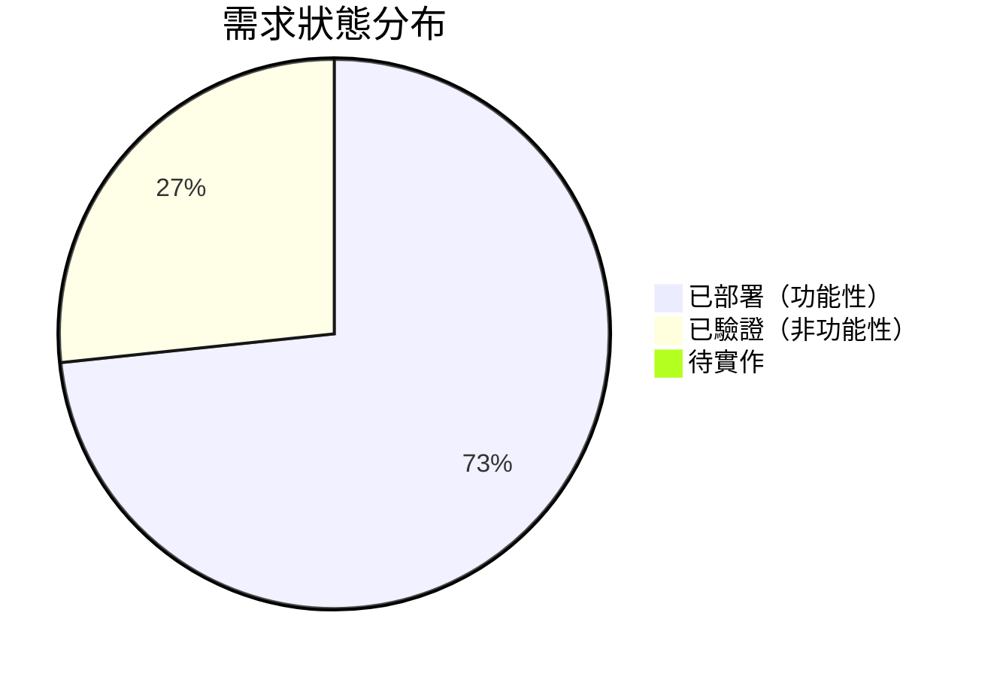

# 需求追溯矩陣（RTM, Requirements Traceability Matrix）

本矩陣追蹤每項需求從來源、設計、實作到驗證的完整生命週期，確保需求可雙向追溯、無遺漏、無孤立實作。

---

## 1. 欄位定義

| 欄位 | 說明 |
|------|------|
| **需求 ID** | SRS 功能性需求編號（FR-x） |
| **需求描述** | 需求內容摘要 |
| **來源** | 需求的原始來源（使用者故事 / 專案章程） |
| **優先級** | P0（必須）／P1（重要）／P2（可有） |
| **狀態** | 已實作／已驗證／已部署 |
| **設計參照** | 對應的 ADR 或架構文件章節 |
| **程式碼參照** | 實作該需求的檔案與方法 |
| **驗證方法** | 驗證該需求的方式（建置通過／手動測試／程式碼審查） |
| **使用者故事** | 對應的 UserStories.md 故事 ID |
| **備註** | 補充說明 |

---

## 2. 追溯矩陣

| 需求 ID | 需求描述 | 來源 | 優先級 | 狀態 | 設計參照 | 程式碼參照 | 驗證方法 | 使用者故事 | 備註 |
|---------|----------|------|--------|------|----------|-----------|----------|-----------|------|
| FR-1 | 遊戲初始化：8x8 棋盤、雙方棋子、3 方塊 3 炸彈、玩家一先行 | ProjectCharter | P0 | 已部署 | ADR-002, Architecture S2 | `Game.initial()` `engine.js` | 建置通過 + 手動測試 | — | 初始棋盤見 Schema S5 |
| FR-2 | 棋子選擇：點擊己方棋子高亮、再次點擊取消 | US-1 | P0 | 已部署 | ADR-002, API S1.3 | `Game.selectChess()` `Game.clearSelection()` `engine.js` | 建置通過 + 手動測試 | US-1 | — |
| FR-3 | 棋子移動：上下左右一格、炸彈引爆、殘骸不可通行 | US-1 | P0 | 已部署 | ADR-002, ADR-004, ER S4 | `Game.moveChess()` `Game.movableTargets()` `engine.js` | 建置通過 + 手動測試 | US-1 | 移動後回合結束 |
| FR-4 | 方塊放置：空格或炸彈格、剩餘數遞減、用完不可選 | US-2 | P0 | 已部署 | ADR-004, API S1.2 | `Game.selectBlock()` `Game.placeBlock()` `Player.useBlock()` `engine.js` | 建置通過 + 手動測試 | US-2 | 可覆蓋隱形炸彈 |
| FR-5 | 炸彈放置：僅空格、隱形、剩餘數遞減、用完不可選 | US-3 | P0 | 已部署 | ADR-006, API S1.2 | `Game.selectBomb()` `Game.placeBomb()` `Player.useBomb()` `engine.js` | 建置通過 + 手動測試 | US-3 | 棋盤上不顯示 |
| FR-6 | 計分與勝利：抵達底線 +1 分、5 分勝、勝利彈窗 | US-4 | P0 | 已部署 | ADR-002, Schema S2 | `Game.moveChess()` `Player.scoreUp()` `engine.js` | 建置通過 + 手動測試 | US-4 | 棋子得分後消失 |
| FR-7 | 回合面板：依玩家切換色彩（藍/紅）、顯示玩家資訊 | US-5 | P0 | 已部署 | ADR-008 | `Sidebar.jsx` `styles.css` | 建置通過 + 手動測試 | US-5 | CSS transition 動畫 |
| FR-8 | 計分進度條：依 score/WINNING_SCORE 比例顯示 | PRD | P1 | 已部署 | — | `Sidebar.jsx` | 建置通過 + 手動測試 | US-4 | — |
| FR-9 | 技能格顯示：各方塊/炸彈列、已使用呈灰、選取高亮 | PRD | P1 | 已部署 | — | `Sidebar.jsx` `SkillRow` | 建置通過 + 手動測試 | US-2, US-3 | — |
| FR-10 | 規則彈窗：首次載入顯示、繁中規則列表、開始按鈕 | US-6 | P1 | 已部署 | ADR-005 | `App.jsx` `Modal.jsx` | 建置通過 + 手動測試 | US-6 | useState 管理 |
| FR-11 | 遊戲重置：再來一局按鈕重置為初始狀態 | US-4 | P1 | 已部署 | ADR-002 | `Game.initial()` `useGame.js` `App.jsx` | 建置通過 + 手動測試 | US-4 | RESET action |

---

## 3. 非功能性需求追溯

| 需求 ID | 需求描述 | 來源 | 優先級 | 狀態 | 設計參照 | 程式碼參照 | 驗證方法 |
|---------|----------|------|--------|------|----------|-----------|----------|
| NFR-1 | 效能：載入至可互動 < 2 秒、gzip JS < 60KB | SRS | P1 | 已驗證 | Architecture S6 | `vite.config.js` | 建置產物 49KB gzip |
| NFR-2 | 相容性：Chrome/Firefox/Safari/Edge 最新版 | SRS | P1 | 已驗證 | — | — | 手動測試 |
| NFR-3 | 可維護性：引擎與 UI 分離、不可變 OOP、TEXT 常數 | SRS | P0 | 已驗證 | ADR-002, ADR-003, ADR-005 | `src/game/` `src/hooks/` `src/components/` | 程式碼審查 |
| NFR-4 | 部署：推送 dev-001 自動合併建置部署、GITHUB_TOKEN | SRS | P0 | 已驗證 | ADR-007, Architecture S4 | `auto-merge.yml` | 管線成功 |

---

## 4. 需求覆蓋率摘要

| 類別 | 總數 | 已實作 | 已驗證 | 已部署 | 覆蓋率 |
|------|------|--------|--------|--------|--------|
| 功能性需求（FR） | 11 | 11 | 11 | 11 | 100% |
| 非功能性需求（NFR） | 4 | 4 | 4 | 4 | 100% |
| **合計** | **15** | **15** | **15** | **15** | **100%** |

---

## 5. 反向追溯（程式碼 → 需求）

確保每段程式碼都有對應的需求，無孤立實作。

| 程式碼 | 對應需求 | 是否有需求 |
|--------|----------|-----------|
| `Game.initial()` | FR-1, FR-11 | 是 |
| `Game.clone()` | ADR-002（基礎設施） | 是 |
| `Game.selectChess()` | FR-2 | 是 |
| `Game.clearSelection()` | FR-2 | 是 |
| `Game.selectBlock()` | FR-4 | 是 |
| `Game.selectBomb()` | FR-5 | 是 |
| `Game.moveChess()` | FR-3, FR-6 | 是 |
| `Game.placeBlock()` | FR-4 | 是 |
| `Game.placeBomb()` | FR-5 | 是 |
| `Game.movableTargets()` | FR-3 | 是 |
| `Game.currentPlayer` (getter) | FR-4, FR-5, FR-7 | 是 |
| `Game.opponent` (getter) | FR-3, FR-4, FR-5 | 是 |
| `Player.useBlock()` | FR-4 | 是 |
| `Player.useBomb()` | FR-5 | 是 |
| `Player.scoreUp()` | FR-6 | 是 |
| `Player.canBlock` (getter) | FR-4 | 是 |
| `Player.canBomb` (getter) | FR-5 | 是 |
| `Cell.*` (工廠方法) | FR-1, FR-3, FR-4, FR-5 | 是 |
| `useGame` reducer | FR-1 ~ FR-11（全部） | 是 |
| `Chessboard.jsx` | FR-2, FR-3, FR-4, FR-5 | 是 |
| `Sidebar.jsx` | FR-7, FR-8, FR-9 | 是 |
| `Modal.jsx` | FR-6, FR-10 | 是 |
| `App.jsx` | FR-1, FR-6, FR-10, FR-11 | 是 |
| `styles.css` `.panel-turn` | FR-7, ADR-008 | 是 |
| `vite.config.js` | NFR-1, NFR-4 | 是 |
| `auto-merge.yml` | NFR-4 | 是 |

> 結論：所有程式碼均有對應需求，無孤立實作。
