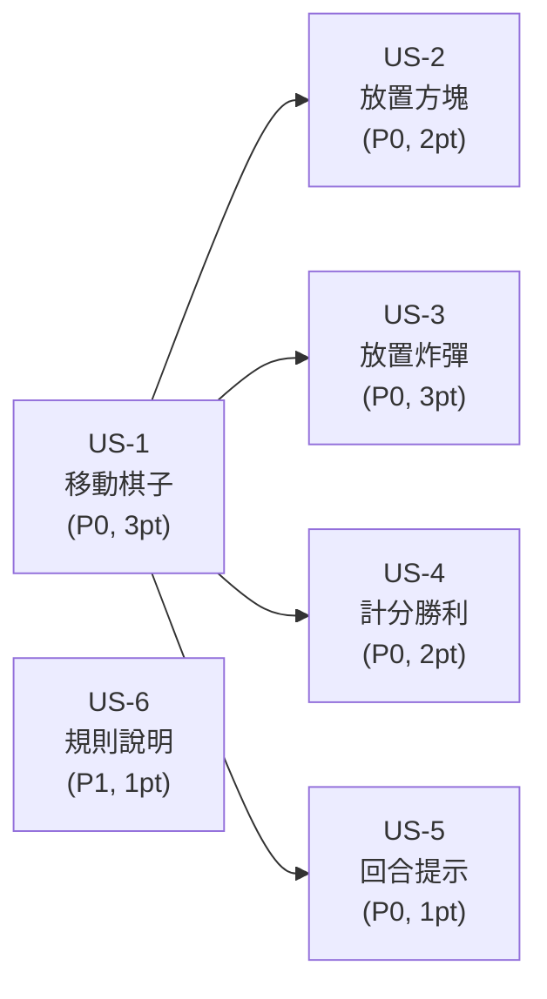

# 使用者故事（User Stories）

本文件以敏捷使用者故事格式詳述產品需求，每則故事附 Given-When-Then 驗收條件、優先級、故事點與相依性。

---

## US-1：移動棋子

> **身為**玩家，
> **我想要**選擇我的棋子並向上／下／左／右移動一格，
> **以便**推進至對方底線得分。

| 屬性 | 值 |
|------|-----|
| 優先級 | P0 |
| 故事點 | 3 |
| 相依 | 無（核心動作） |
| 對應 SRS | FR-2, FR-3 |

### 驗收條件

```gherkin
Scenario: 選取己方棋子
  Given 當前為玩家一回合
  When 點擊玩家一的棋子
  Then 該棋子高亮顯示
  And 相鄰可移動的空格顯示方向箭頭

Scenario: 取消選取
  Given 已選取一枚棋子
  When 再次點擊該棋子
  Then 取消選取，高亮與箭頭消失

Scenario: 移動至空格
  Given 已選取己方棋子
  When 點擊相鄰空格
  Then 棋子移動至該格
  And 原格變為空格
  And 回合結束，輪到對方

Scenario: 無法移動至佔用格
  Given 已選取己方棋子
  When 點擊被方塊或殘骸佔用的格子
  Then 不發生任何動作

Scenario: 只能移動一格
  Given 已選取己方棋子
  When 點擊距離超過一格的格子
  Then 不發生任何動作
```

---

## US-2：放置方塊

> **身為**玩家，
> **我想要**在空格或隱形炸彈上放置方塊，
> **以便**阻擋對手的移動路線。

| 屬性 | 值 |
|------|-----|
| 優先級 | P0 |
| 故事點 | 2 |
| 相依 | US-1（回合系統） |
| 對應 SRS | FR-4 |

### 驗收條件

```gherkin
Scenario: 選擇方塊技能
  Given 當前為玩家一回合且方塊剩餘數 > 0
  When 點擊玩家一的方塊技能格
  Then 方塊技能格高亮顯示

Scenario: 放置方塊於空格
  Given 已選擇方塊技能
  When 點擊棋盤上的空格
  Then 該格顯示方塊圖示
  And 方塊剩餘數 -1
  And 回合結束，輪到對方

Scenario: 放置方塊於炸彈格
  Given 已選擇方塊技能且某格有隱形炸彈
  When 點擊該格
  Then 該格顯示方塊圖示（炸彈被覆蓋）
  And 方塊剩餘數 -1
  And 回合結束

Scenario: 方塊用完無法選擇
  Given 玩家一方塊剩餘數為 0
  When 點擊玩家一的方塊技能格
  Then 不發生任何動作

Scenario: 無法放置於棋子或方塊上
  Given 已選擇方塊技能
  When 點擊被棋子或方塊佔用的格子
  Then 不發生任何動作
```

---

## US-3：放置炸彈

> **身為**玩家，
> **我想要**在空格上放置隱形炸彈，
> **以便**讓對手棋子踩到時被消滅。

| 屬性 | 值 |
|------|-----|
| 優先級 | P0 |
| 故事點 | 3 |
| 相依 | US-1（回合系統） |
| 對應 SRS | FR-5 |

### 驗收條件

```gherkin
Scenario: 選擇炸彈技能
  Given 當前為玩家一回合且炸彈剩餘數 > 0
  When 點擊玩家一的炸彈技能格
  Then 炸彈技能格高亮顯示

Scenario: 放置炸彈於空格
  Given 已選擇炸彈技能
  When 點擊棋盤上的空格
  Then 該格在棋盤上顯示為空格（炸彈隱形）
  And 炸彈剩餘數 -1
  And 回合結束，輪到對方

Scenario: 棋子踩到炸彈
  Given 已選取棋子且相鄰格有隱形炸彈
  When 移動棋子至該格
  Then 棋子被消滅
  And 該格變為爆炸殘骸（不可通行）
  And 回合結束

Scenario: 炸彈用完無法選擇
  Given 玩家一炸彈剩餘數為 0
  When 點擊玩家一的炸彈技能格
  Then 不發生任何動作

Scenario: 無法放置於非空格
  Given 已選擇炸彈技能
  When 點擊被棋子、方塊、炸彈或殘骸佔用的格子
  Then 不發生任何動作
```

---

## US-4：計分與勝利

> **身為**玩家，
> **我想要**讓棋子抵達對方底線得分，先達 5 分獲勝，
> **以便**有明確的勝負目標。

| 屬性 | 值 |
|------|-----|
| 優先級 | P0 |
| 故事點 | 2 |
| 相依 | US-1（移動） |
| 對應 SRS | FR-6 |

### 驗收條件

```gherkin
Scenario: 玩家一得分
  Given 玩家一棋子位於倒數第二欄
  When 移動棋子至最右欄（H 欄）
  Then 玩家一得分 +1
  And 該棋子消失，格子變為空格
  And 側邊欄計分進度條更新
  And 回合結束

Scenario: 玩家二得分
  Given 玩家二棋子位於第二欄
  When 移動棋子至最左欄（A 欄）
  Then 玩家二得分 +1
  And 該棋子消失，格子變為空格
  And 回合結束

Scenario: 達到獲勝分數
  Given 某玩家已有 4 分
  When 該玩家棋子抵達底線，得分達 5
  Then 顯示勝利彈窗
  And 棋盤不可互動

Scenario: 得分後重置遊戲
  Given 勝利彈窗已顯示
  When 點擊「再來一局」
  Then 遊戲重置為初始狀態
  And 彈窗關閉
```

---

## US-5：回合切換提示

> **身為**玩家，
> **我想要**清楚知道當前是誰的回合，
> **以便**避免在對方回合誤操作。

| 屬性 | 值 |
|------|-----|
| 優先級 | P0 |
| 故事點 | 1 |
| 相依 | US-1（回合系統） |
| 對應 SRS | FR-7 |

### 驗收條件

```gherkin
Scenario: 玩家一回合顯示
  Given 當前為玩家一回合
  Then 回合面板背景為藍色漸層
  And 顯示玩家一的棋子圖示與名稱
  And 玩家一的技能格可點擊
  And 玩家二的技能格呈灰色不可點擊

Scenario: 回合切換後顯示更新
  Given 玩家一完成動作
  When 回合切換至玩家二
  Then 回合面板背景切換為紅色漸層
  And 顯示玩家二的棋子圖示與名稱
  And 玩家二的技能格可點擊
  And 玩家一的技能格呈灰色不可點擊

Scenario: 對方回合無法操作
  Given 當前為玩家一回合
  When 點擊玩家二的技能格
  Then 不發生任何動作
```

---

## US-6：規則說明

> **身為**新玩家，
> **我想要**在遊戲開始時看到規則說明，
> **以便**快速理解遊戲玩法。

| 屬性 | 值 |
|------|-----|
| 優先級 | P1 |
| 故事點 | 1 |
| 相依 | 無 |
| 對應 SRS | FR-10 |

### 驗收條件

```gherkin
Scenario: 首次載入顯示規則
  Given 使用者首次開啟遊戲
  Then 顯示規則彈窗
  And 彈窗內容為繁體中文規則列表
  And 棋盤在彈窗後方可見

Scenario: 關閉規則開始遊戲
  Given 規則彈窗已顯示
  When 點擊「開始遊戲」按鈕
  Then 彈窗關閉
  And 遊戲可開始操作

Scenario: 勝利後顯示勝利彈窗
  Given 某玩家達到獲勝分數
  Then 顯示勝利彈窗
  And 彈窗顯示獲勝玩家
  And 點擊「再來一局」可重置遊戲
```

---

## 故事總覽

| 故事 | 標題 | 優先級 | 故事點 | 相依 |
|------|------|--------|--------|------|
| US-1 | 移動棋子 | P0 | 3 | — |
| US-2 | 放置方塊 | P0 | 2 | US-1 |
| US-3 | 放置炸彈 | P0 | 3 | US-1 |
| US-4 | 計分與勝利 | P0 | 2 | US-1 |
| US-5 | 回合切換提示 | P0 | 1 | US-1 |
| US-6 | 規則說明 | P1 | 1 | — |
| **合計** | | | **12** | |

### 依賴關係圖



### 開發順序建議

1. **US-1**（移動棋子）—— 核心基礎，其他故事皆相依
2. **US-5**（回合提示）—— 回合切換是所有動作的前提
3. **US-4**（計分勝利）—— 勝負條件確立遊戲目標
4. **US-2**（放置方塊）—— 策略元素之一
5. **US-3**（放置炸彈）—— 策略元素之二
6. **US-6**（規則說明）—— 使用者體驗完善
